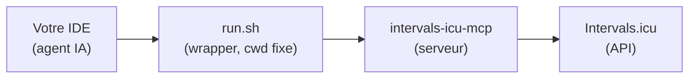

# 🔄 Configuration Intervals.icu (source alternative, #68)

Cette page détaille la source de données **Intervals.icu**, l'alternative à
Garmin Connect pour les athlètes qui n'ont pas de montre Garmin (COROS,
Suunto, Polar, Apple — tout ce qu'Intervals.icu synchronise). Elle est
installée par `./install.sh --source intervals`, **à la place** de Garmin, pas
en plus.

!!! info "Ceci ne change rien si vous utilisez Garmin"
    Par défaut (`[data].source = "garmin"`, ou pas de clé du tout), rien dans
    ce projet ne change : `install.sh` continue d'installer `garmin-mcp`
    exactement comme avant, et ne touche jamais à `[data]` dans
    `config/workspace.user.toml` tant que vous n'avez jamais passé `--source`
    vous-même — un simple `./install.sh` relancé plus tard ne fera jamais
    revenir un athlète Intervals.icu vers Garmin en silence (il relit
    `[data].source` de la config existante). Cette page ne s'applique que si
    vous avez choisi la source Intervals.icu.

## Architecture



- **`intervals-icu-mcp`** — serveur MCP communautaire retenu par le projet :
  [`eddmann/intervals-icu-mcp`](https://github.com/eddmann/intervals-icu-mcp),
  **épinglé au commit `cb91d4a`** (`INTERVALS_MCP_REF` dans `install.sh`) — un
  changement en amont (renommage d'outil, retrait de champ) ne doit jamais
  casser silencieusement ce projet. 48 outils au total (activités, wellness,
  calendrier/événements, profil, forme) ; ce projet n'en documente et n'en
  vérifie qu'un sous-ensemble, voir la table de correspondance dans
  `AGENTS.md`. `./install.sh --source intervals` l'installe avec
  `uv tool install`, comme `garmin-mcp` pour Garmin.
- **`intervals-icu-mcp-auth`** — outil d'authentification interactif du même
  paquet (clé API + identifiant athlète), lancé par `install.sh` **directement**
  (pas via `uv run`, qui chercherait un projet uv dans le répertoire courant)
  dans un dossier dédié **hors du dépôt** :
  `~/.config/ai-running-coach/intervals-icu-mcp/.env` (jamais commité).
- **`run.sh`** — petit wrapper que `install.sh` écrit dans ce même dossier
  (`~/.config/ai-running-coach/intervals-icu-mcp/run.sh`) et que **toute la
  configuration MCP référence** — voir pourquoi ci-dessous.

## Composants installés

| Composant | Rôle | Installation |
|---|---|---|
| `uv` | Gestionnaire Python | `curl -LsSf https://astral.sh/uv/install.sh \| sh` |
| `intervals-icu-mcp` | Serveur MCP Intervals.icu | `uv tool install --python 3.12 "git+https://github.com/eddmann/intervals-icu-mcp@cb91d4a..."` |
| `intervals-icu-mcp-auth` | Authentification (clé API + athlete ID) | `(cd ~/.config/ai-running-coach/intervals-icu-mcp && intervals-icu-mcp-auth)` |
| `run.sh` | Wrapper que la config MCP référence | écrit par `install.sh`, non téléchargé |

## Obtenir une clé API

1. Allez sur <https://intervals.icu/settings>.
2. Section « Developer » → « Create API Key ».
3. Notez aussi votre identifiant athlète (format `i123456`, visible dans l'URL de votre profil).

`./install.sh --source intervals` vous les demande interactivement (sauf
`--no-auth`) et les écrit dans le `.env` mentionné ci-dessus — jamais dans le
dépôt, jamais dans une config d'IDE.

## Pourquoi un wrapper, et pas une variable d'environnement

`intervals-icu-mcp` charge ses identifiants depuis un fichier `.env`
**relatif à son répertoire de travail** (`pydantic-settings`,
`env_file=".env"`) — pas depuis une variable que l'IDE lui passerait. Or
l'IDE démarre le serveur MCP avec pour répertoire de travail celui du
**projet**, pas `~/.config/ai-running-coach/intervals-icu-mcp/`. Un bloc
`"env": {"INTERVALS_ICU_API_KEY": "${VAR}"}` dans la config MCP ne marche
**nulle part** : rien n'exporte cette variable dans le processus de l'IDE,
certains IDE (OpenCode) n'interpolent même pas `${VAR}`, et de toute façon une
variable d'environnement présente écraserait le `.env` sans jamais
l'atteindre puisque le process ne serait toujours pas dans le bon dossier.

`install.sh` écrit donc un petit wrapper à la place :

```bash
#!/usr/bin/env bash
set -euo pipefail
cd "$(dirname "${BASH_SOURCE[0]}")"
exec intervals-icu-mcp "$@"
```

Et référence **ce wrapper**, jamais `intervals-icu-mcp` directement, dans la
config MCP :

```json
{
  "mcpServers": {
    "intervals": {
      "command": "/Users/vous/.config/ai-running-coach/intervals-icu-mcp/run.sh",
      "args": []
    }
  }
}
```

Aucun secret dans ce fichier — le wrapper force simplement le bon répertoire
de travail avant d'exécuter le serveur, quel que soit l'IDE ou le dossier
depuis lequel il le lance.

## Ce qui change pour les agents

`coach`, `medical` et `garmin-daily-sync` (`/garmin-daily-sync`) utilisent
alors les outils du serveur `intervals` au lieu de `garmin` pour les
**lectures** (activités, wellness), avec le même contrat de données (fichiers
`activities/`, `medical/`, bloc ```arc```, persistance immédiate). Voir la
table de correspondance complète dans
[`AGENTS.md`](https://github.com/mmornati/ai-running-coach/blob/main/AGENTS.md#correspondance-des-outils--garmin--intervalsicu-68).

**Le push de séances planifiées n'est PAS un simple changement de nom
d'outil** : le skill `intervals-icu-best-practices` remplace
`garmin-workout-scheduling` avec un fonctionnement différent — pas de
paramètre structuré (`create_event`/`update_event` n'ont pas de `workout_doc`,
les cibles s'écrivent en texte dans `description`), pas d'upsert (vérification
`get_calendar_events` avant chaque push), vérification limitée aux champs que
`get_event` renvoie réellement.

## Fonctionnalités et champs indisponibles avec cette source

Aucune valeur n'est jamais devinée à leur place — l'agent dit explicitement
qu'elles ne sont pas disponibles :

- **Score de readiness algorithmique** (Garmin Training Readiness) —
  Intervals.icu n'a pas d'équivalent calculé. Le champ `subjective.readiness`
  existe mais c'est une valeur manuelle du jour, qui peut venir de vous ou
  d'un autre appareil synchronisé (Oura, Whoop...) — jamais présentée comme
  équivalente au score Garmin.
- **Fréquence cardiaque de récupération (HRR) et `splits` par km** — absents
  des activités renvoyées par ce serveur. `course-comparison` (qui exige des
  `splits`) n'est donc pas utilisable sur des activités synchronisées depuis
  Intervals.icu.
- **FIT des activités importées depuis Strava** — l'API Strava interdit à
  Intervals.icu de les redistribuer : ni FIT, ni courbes. Connectez la montre
  (ou l'app qui l'exporte : Garmin Connect, COROS, Suunto, Polar, HealthFit
  pour l'Apple Watch…) **directement** à Intervals.icu pour que vos séances
  aient leur FIT. Les autres activités l'ont — voir « Fichiers FIT » ci-dessous.
- **Upload de parcours** (`course-strategist`) — reste limité à l'analyse GPX
  locale (skill `gpx-analysis`).

## Cycle menstruel (opt-in, #166)

Avec `[health].cycle_tracking = "intervals"`, la phase vient du champ wellness `menstrualPhase`,
exposé par `get_wellness_for_date` sous `other.menstrual_phase` (vérifié dans le serveur épinglé ;
valeurs possibles non définies par le serveur, à vérifier). Aucune installation à refaire. Voir
[Cycle menstruel](cycle-menstruel.md).

## Fichiers FIT

Intervals.icu garde le fichier d'origine de chaque activité importée depuis une
montre. `skills/fit-download/scripts/download_fit.py` le télécharge par l'API
REST, avec la même clé API que le serveur MCP (pas de nouvelle configuration),
et en tire les échantillons seconde par seconde qui débloquent les KPI fins —
zones FC, allure ajustée à la pente, découplage cardiaque, VAM des montées,
descente, durabilité, dépense énergétique modèle — et `session-parts-analyzer` :

```bash
python3 skills/fit-download/scripts/download_fit.py i123456789 --json   # une séance
python3 skills/fit-download/scripts/download_fit.py --from-dir activities/ --json   # tout l'historique
python3 scripts/arc_index.py                                            # réindexe
```

La source est lue dans `[data].source` (forcer avec `--source intervals`).
`--from-dir` relit l'`intervals_activity_id` du bloc ```` ```arc ```` de chaque
séance et saute celles déjà téléchargées. Une activité importée depuis Strava
est signalée `INDISPONIBLE` avec sa raison, puis ignorée.

Le téléchargement n'utilise que la bibliothèque standard ; la lecture du FIT
(`--json`) a besoin de `fitparse`, que `./install.sh --source intervals`
installe dans l'environnement `intervals-icu-mcp` — sur une installation
antérieure, relancez simplement cette commande (elle ajoute `fitparse` sans
réinstaller le serveur).

## Matériel et attribution par séance

Vérifié dans le code source du serveur épinglé (`INTERVALS_MCP_REF`, `tools/gear.py`) : il expose
un **inventaire** de matériel (`get_gear_list` : id, nom, type, `usage.total_distance_km`, rappels)
et des outils d'écriture (`create_gear`, `update_gear`, `delete_gear`, `create_gear_reminder`). En
revanche les activités (`tools/activities.py`, `tools/activity_analysis.py`) ne portent **aucun champ
matériel** : l'attribution par séance n'est donc **pas disponible** avec cette source. Le coach
n'attribue jamais un matériel de lui-même : `gear_id` reste déclaré par vous en chat ou tombe
sur la paire `(par défaut)`. `get_gear_list` n'est qu'une référence de lecture (par exemple pour
vérifier un kilométrage) — jamais une source d'attribution, et le segment `garmin: <uuid>` du
profil n'a aucun effet ici. Voir [Synchronisation du matériel Garmin](garmin-setup.md#synchronisation-du-materiel-garmin).

## Passer d'une source à l'autre

```bash
./install.sh --source intervals   # bascule vers Intervals.icu
./install.sh --source garmin      # revient à Garmin
```

Chaque appel réécrit `[data].source` dans `config/workspace.user.toml` (sans
toucher aux autres réglages) et **retire l'entrée MCP de l'ancienne source**
de `.mcp.json`/l'équivalent de chaque IDE configuré (et de la liste des
serveurs approuvés dans `~/.claude.json` pour Claude Code) avant d'écrire la
nouvelle — votre IDE ne propose donc jamais les deux serveurs à la fois. Le
binaire de l'ancienne source (`garmin-mcp` ou `intervals-icu-mcp`) reste
installé sur votre machine (rien n'est désinstallé automatiquement) ; seule sa
déclaration dans la configuration MCP disparaît.
