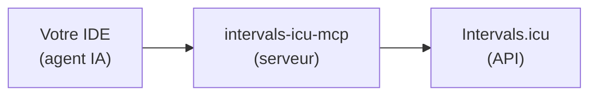

# 🔄 Configuration Intervals.icu (source alternative, #68)

Cette page détaille la source de données **Intervals.icu**, l'alternative à
Garmin Connect pour les athlètes qui n'ont pas de montre Garmin (COROS,
Suunto, Polar, Apple — tout ce qu'Intervals.icu synchronise). Elle est
installée par `./install.sh --source intervals`, **à la place** de Garmin, pas
en plus.

!!! info "Ceci ne change rien si vous utilisez Garmin"
    Par défaut (`[data].source = "garmin"`, ou pas de clé du tout), rien dans
    ce projet ne change : `install.sh` continue d'installer `garmin-mcp`
    exactement comme avant. Cette page ne s'applique que si vous avez choisi
    la source Intervals.icu.

## Architecture



- **`intervals-icu-mcp`** — serveur MCP communautaire retenu par le projet :
  [`eddmann/intervals-icu-mcp`](https://github.com/eddmann/intervals-icu-mcp)
  (48 outils : activités, wellness, calendrier/événements, profil, forme).
  `./install.sh --source intervals` l'installe avec `uv tool install`, comme
  `garmin-mcp` pour Garmin.
- **`intervals-icu-mcp-auth`** — outil d'authentification interactif du même
  paquet (clé API + identifiant athlète), lancé par `install.sh` dans un
  répertoire dédié **hors du dépôt** : `~/.config/ai-running-coach/intervals-icu-mcp/.env`
  (jamais commité, jamais dans le dépôt).

## Composants installés

| Composant | Rôle | Installation |
|---|---|---|
| `uv` | Gestionnaire Python | `curl -LsSf https://astral.sh/uv/install.sh \| sh` |
| `intervals-icu-mcp` | Serveur MCP Intervals.icu | `uv tool install --python 3.12 git+https://github.com/eddmann/intervals-icu-mcp` |
| `intervals-icu-mcp-auth` | Authentification (clé API + athlete ID) | `(cd ~/.config/ai-running-coach/intervals-icu-mcp && uv run intervals-icu-mcp-auth)` |

## Obtenir une clé API

1. Allez sur <https://intervals.icu/settings>.
2. Section « Developer » → « Create API Key ».
3. Notez aussi votre identifiant athlète (format `i123456`, visible dans l'URL de votre profil).

`./install.sh --source intervals` vous les demande interactivement (sauf
`--no-auth`) et les écrit dans le `.env` mentionné ci-dessus — jamais dans le
dépôt.

## Configuration MCP générée

```json
{
  "mcpServers": {
    "intervals": {
      "command": "intervals-icu-mcp",
      "args": [],
      "env": {
        "INTERVALS_ICU_API_KEY": "${INTERVALS_ICU_API_KEY}",
        "INTERVALS_ICU_ATHLETE_ID": "${INTERVALS_ICU_ATHLETE_ID}"
      }
    }
  }
}
```

!!! warning "Jamais de secret écrit en clair"
    `${INTERVALS_ICU_API_KEY}`/`${INTERVALS_ICU_ATHLETE_ID}` sont des
    références substituées par votre shell/IDE au lancement — pas des valeurs
    écrites ici. Exportez-les dans votre profil shell (`~/.zshrc`, etc.) après
    l'authentification interactive, en les relisant depuis le `.env` créé par
    `intervals-icu-mcp-auth` — ne les collez jamais directement dans un
    fichier versionné. Certains IDE utilisent une autre syntaxe de référence
    pour leurs variables d'environnement : adaptez `.mcp.json`/l'équivalent de
    votre IDE si `${VAR}` n'y est pas résolu.

## Ce qui change pour les agents

`coach`, `medical` et `garmin-daily-sync` (`/garmin-daily-sync`) utilisent
alors les outils du serveur `intervals` au lieu de `garmin`, avec le même
contrat de données (fichiers `activities/`, `medical/`, bloc ```arc```,
persistance immédiate). Voir la table de correspondance complète dans
[`AGENTS.md`](https://github.com/mmornati/ai-running-coach/blob/main/AGENTS.md#correspondance-des-outils--garmin--intervalsicu-68).

## Fonctionnalités indisponibles avec cette source

Aucune valeur n'est jamais devinée à leur place — l'agent dit explicitement
qu'elles ne sont pas disponibles :

- **Score de readiness algorithmique** (Garmin Training Readiness) —
  Intervals.icu n'a pas d'équivalent calculé, seulement un champ
  `subjective.readiness` auto-déclaré par l'athlète, jamais présenté comme
  équivalent.
- **Téléchargement FIT** et tout ce qui en dépend (`fit-download`,
  `session-parts-analyzer`, KPI GAP/VAM/décrochage cardiaque/durabilité) — le
  script du projet est câblé sur `garminconnect`, pas sur l'API Intervals.icu.
- **Upload de parcours** (`course-strategist`) — reste limité à l'analyse GPX
  locale (skill `gpx-analysis`).

## Passer d'une source à l'autre

```bash
./install.sh --source intervals   # bascule vers Intervals.icu
./install.sh --source garmin      # revient à Garmin (défaut)
```

Chaque appel réécrit uniquement `[data].source` dans
`config/workspace.user.toml`, sans toucher aux autres réglages. Le serveur MCP
de l'ancienne source reste installé (rien n'est désinstallé automatiquement) —
il est simplement absent de la configuration MCP tant que vous ne repassez pas
dessus.
