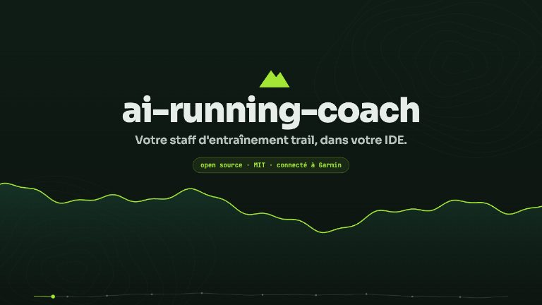
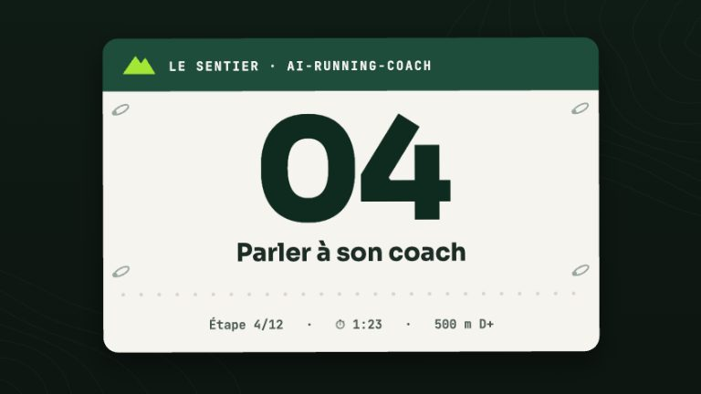
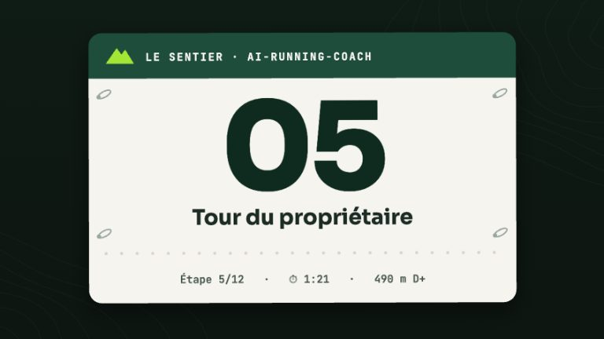
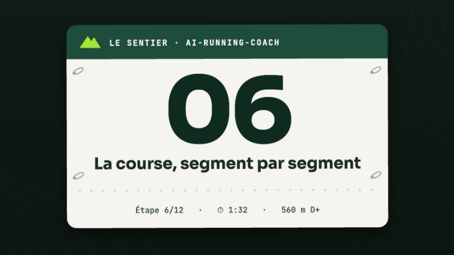
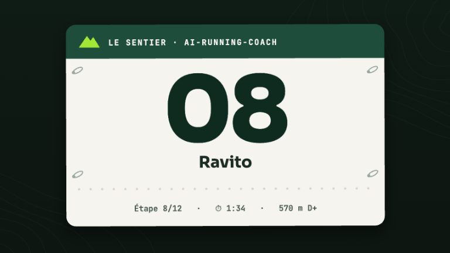
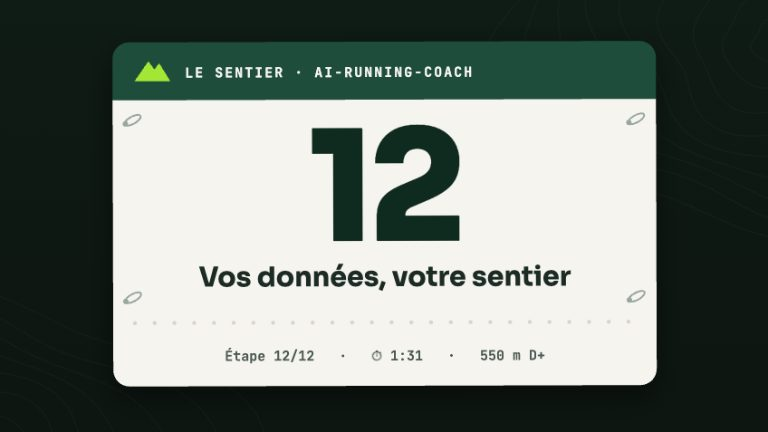

# Le Sentier — les vidéos

<div class="arc-page-banner" markdown>

</div>

**Le Sentier** est une série de courtes vidéos, une par fonctionnalité, à mi-chemin
entre la démonstration et la documentation. Chaque vidéo est une **étape** : un dossard au
départ, des **ravitos** (les chapitres, cliquables sur le profil altimétrique du lecteur) et
une arche d'arrivée qui renvoie vers la page de documentation correspondante.

On y suit **Camille**, une athlète fictive qui prépare le *Trail des Crêtes* (42 km,
2 100 m D+). Toutes les données montrées sont inventées.

!!! tip "Dans le lecteur"
    Narration en **français** ou en **anglais** (sélecteur de langue), **sous-titres**
    (bouton ou touche `c`), espace pour lecture/pause, flèches pour ±5 s. Le tableau de bord
    n'existe qu'en français : les versions anglaises gardent ses captures, légendées en anglais.

<!-- arc-videos:start -->
<div class="arc-videos" markdown>

<div class="arc-video arc-video--featured" markdown>

[](video/index.html)

<span class="arc-video__meta">Bande-annonce · 1 min 29</span>

### [La bande-annonce](video/index.html)

Le projet en un coup d'œil : le staff, le bilan matinal, les garde-fous, le jour de course, vos données.

[Regarder](video/index.html) · [English (1 min 33)](video/index.html?lang=en)

</div>

<div class="arc-video" markdown>

[](video/ligne-de-depart/index.html)

<span class="arc-video__meta">Étape 01 · 1 min 34</span>

### [Ligne de départ](video/ligne-de-depart/index.html)

Du git clone au premier /today : installation, authentification Garmin, /coach-setup et /coach-doctor en moins de deux minutes.

[Regarder](video/ligne-de-depart/index.html) · [English (1 min 38)](video/ligne-de-depart/index.html?lang=en) · [La documentation](quickstart.md)

</div>

<div class="arc-video" markdown>

[](video/bilan-matinal/index.html)

<span class="arc-video__meta">Étape 02 · 1 min 11</span>

### [Le réveil du traileur](video/bilan-matinal/index.html)

HRV, FC de repos et readiness lues ensemble chaque matin : le verdict, sa raison, et comment régler le bilan.

[Regarder](video/bilan-matinal/index.html) · [English (1 min 14)](video/bilan-matinal/index.html?lang=en) · [La documentation](skills/today.md)

</div>

<div class="arc-video" markdown>

[](video/garde-fous/index.html)

<span class="arc-video__meta">Étape 03 · 1 min 31</span>

### [Le plan qui sait dire non](video/garde-fous/index.html)

Sept garde-fous calculés relisent la semaine avant son écriture et son envoi au calendrier Garmin : un second avis déterministe et testé.

[Regarder](video/garde-fous/index.html) · [English (1 min 40)](video/garde-fous/index.html?lang=en) · [La documentation](guardrails.md)

</div>

<div class="arc-video" markdown>

[](video/chat-coach/index.html)

<span class="arc-video__meta">Étape 04 · 1 min 24</span>

### [Parler à son coach](video/chat-coach/index.html)

Le chat du tableau de bord : trace des outils, carte d'approbation, politique de permissions, budget et fournisseurs.

[Regarder](video/chat-coach/index.html) · [English (1 min 34)](video/chat-coach/index.html?lang=en) · [La documentation](dashboard/chat.md)

</div>

<div class="arc-video" markdown>

[](video/tableau-de-bord/index.html)

<span class="arc-video__meta">Étape 05 · 1 min 22</span>

### [Tour du propriétaire](video/tableau-de-bord/index.html)

Visite guidée du tableau de bord local, en lecture seule : une question par vue.

[Regarder](video/tableau-de-bord/index.html) · [English (1 min 25)](video/tableau-de-bord/index.html?lang=en) · [La documentation](dashboard/views.md)

</div>

<div class="arc-video" markdown>

[](video/jour-de-course/index.html)

<span class="arc-video__meta">Étape 06 · 1 min 33</span>

### [La course, segment par segment](video/jour-de-course/index.html)

Du GPX au plan de course : allures par segment, énergie, matériel obligatoire, montre, puis débrief plan contre réalisé.

[Regarder](video/jour-de-course/index.html) · [English (1 min 39)](video/jour-de-course/index.html?lang=en) · [La documentation](agents/course-strategist.md)

</div>

<div class="arc-video" markdown>

[](video/analyse-seance/index.html)

<span class="arc-video__meta">Étape 07 · 1 min 32</span>

### [Disséquer une sortie](video/analyse-seance/index.html)

Une sortie trail passée au scalpel : FIT, zones, allure ajustée, dérive, montées, durabilité, HRR, énergie, comparaison.

[Regarder](video/analyse-seance/index.html) · [English (1 min 37)](video/analyse-seance/index.html?lang=en) · [La documentation](skills/session-parts-analyzer.md)

</div>

<div class="arc-video" markdown>

[](video/ravito/index.html)

<span class="arc-video__meta">Étape 08 · 1 min 35</span>

### [Ravito](video/ravito/index.html)

Une phrase libre devient des données : le modèle extrait, le script calcule, et ne devine jamais un produit.

[Regarder](video/ravito/index.html) · [English (1 min 40)](video/ravito/index.html?lang=en) · [La documentation](skills/log.md)

</div>

<div class="arc-video" markdown>

[](video/materiel/index.html)

<span class="arc-video__meta">Étape 09 · 1 min 32</span>

### [Usure](video/materiel/index.html)

Du kilométrage à l'inspection photo : alerte de seuil, verdict en quatre couleurs, indices de foulée (jamais un diagnostic), foulée mesurée, kits et bilan de carrière.

[Regarder](video/materiel/index.html) · [English (1 min 39)](video/materiel/index.html?lang=en) · [La documentation](skills/gear-inspection.md)

</div>

<div class="arc-video" markdown>

[](video/coach-poche/index.html)

<span class="arc-video__meta">Étape 10 · 1 min 33</span>

### [Le coach dans la poche](video/coach-poche/index.html)

La machine coach, la synchronisation automatique (horaires ou veille), la notification push, Remote Control et les commandes courtes, le tableau de bord mobile, et ce qui n'est pas possible.

[Regarder](video/coach-poche/index.html) · [English (1 min 39)](video/coach-poche/index.html?lang=en) · [La documentation](mobile.md)

</div>

<div class="arc-video" markdown>

[](video/styles-coaching/index.html)

<span class="arc-video__meta">Étape 11 · 1 min 31</span>

### [Trois voix, une décision](video/styles-coaching/index.html)

La même décision dite par trois styles de coaching : le ton, la fermeté et la longueur se règlent, jamais le verdict.

[Regarder](video/styles-coaching/index.html) · [English (1 min 37)](video/styles-coaching/index.html?lang=en) · [La documentation](configuration.md)

</div>

<div class="arc-video" markdown>

[](video/donnees/index.html)

<span class="arc-video__meta">Étape 12 · 1 min 32</span>

### [Vos données, votre sentier](video/donnees/index.html)

Vos données restent des fichiers Markdown chez vous : un bloc validé, un index jetable, un tableau de bord local, et ce qui quitte la machine.

[Regarder](video/donnees/index.html) · [English (1 min 38)](video/donnees/index.html?lang=en) · [La documentation](workspace.md)

</div>

</div>
<!-- arc-videos:end -->

## Comment c'est fait

Aucun fichier vidéo n'est stocké : chaque image est **dessinée en JavaScript** sur un canvas,
à partir du seul temps écoulé. Une vidéo se lit, se met en pause et se parcourt comme une
vraie, mais pèse quelques dizaines de kilo-octets (plus sa piste de voix).

| Élément | Où | Rôle |
|---|---|---|
| Moteur | `docs/video/engine/` | Lecteur, profil altimétrique, dossard, arche d'arrivée, outils de dessin |
| Script | `docs/video/<étape>/script.json` | Découpage en scènes et texte dit, en français et en anglais |
| Scènes | `docs/video/<étape>/scenes.js` | Le dessin de chaque scène, calé sur les répliques |
| Voix | `audio/<langue>.m4a`, `timing.js`, `subs.<langue>.vtt` | Générés par `scripts/video_narration.py` |
| Captures | `docs/video/shots/` | Le vrai tableau de bord, servi sur l'espace de travail fictif de Camille |

La voix est une **synthèse vocale locale** ([Kokoro](https://github.com/thewh1teagle/kokoro-onnx),
hors ligne) : `ff_siwis` en français, `bm_george` en anglais. Les mots qu'elle prononce mal
se corrigent dans `docs/video/lexicon.json`, sans toucher aux sous-titres.

```bash
# 1. l'espace de travail fictif de Camille, puis les captures du tableau de bord
python3 scripts/video_demo_workspace.py /tmp/camille
uv run --with playwright scripts/video_capture.py

# 2. la voix, le minutage et les sous-titres (modèle Kokoro dans ~/.cache/kokoro-onnx)
uv run --with kokoro-onnx --with soundfile scripts/video_narration.py garde-fous

# 3. la galerie de cette page et les vignettes
uv run --with playwright scripts/video_gallery.py --posters

# 4. un MP4 (voix + sous-titres désactivables), ou toute la série
uv run --with playwright scripts/render_video.py --episode garde-fous --lang en
uv run --with playwright scripts/render_video.py --episode all --burn-subs
```

Le palier B des tests vérifie que le minutage, la galerie et les vignettes sont à jour
(`python3 scripts/video_narration.py --check`, `python3 scripts/video_gallery.py --check`).
